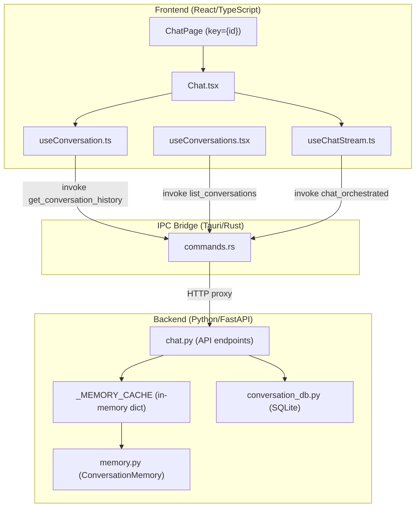

# Diagnostic — Perte de Conversations dans LOKO

**Date** : 8 mars 2026  
**Symptômes signalés** :
1. Quand on navigue dans l'application et qu'on revient sur un message, le contenu disparaît
2. Quand on ferme/rouvre l'application, toutes les conversations sont perdues
3. La base SQLite est censée persister les données, mais elles ne sont pas récupérées

---

## Architecture actuelle — Flux de données



---

## Anomalies identifiées

### ⚠️ ANOMALIE 1 — État React éphémère : conversations perdues au redémarrage

**Fichier** : `desktop/src/hooks/useConversations.tsx` (lignes 63-80)

**Problème** : La liste des conversations est stockée dans un simple `useState<ConversationListItem[]>([])`. Au montage, `refreshList()` appelle `ipc.listConversations()` qui fait `GET /api/chat/conversations`. Cette requête va au backend Python.

**Pourquoi c'est un souci** : Au démarrage de l'application, le backend Python peut ne pas être encore prêt quand le frontend essaie de charger la liste. Le hook a un mécanisme de retry (lignes 84-104), mais si la requête échoue silencieusement ou renvoie `null` (ligne 78: `catch { return null }`), la liste locale reste vide `[]`.

**Conséquence** : Si le premier chargement échoue et que le retry échoue aussi, la sidebar affiche zéro conversation même si SQLite en contient.

**Gravité** : 🟡 Moyen — le retry devrait finir par fonctionner, mais si le backend met trop de temps ou si le port change, les conversations semblent "perdues".

---

### 🔴 ANOMALIE 2 — `ChatPage key={id}` détruit et reconstruit tout le composant Chat

**Fichier** : `desktop/src/App.tsx` (ligne 78)

```tsx
return <Chat key={id} />;
```

**Problème** : Le `key={id}` force React à **démonter et remonter** complètement le composant `Chat` chaque fois que l'ID change. Cela signifie que :
- Tout l'état local du Chat est détruit (streaming en cours, historique chargé, query active)
- Le `useConversation` est recréé à zéro avec `emptyHistory`
- Le `useChatStream` est recréé aussi, perdant `finalResponse`, `content`, etc.

**Conséquence directe** : Quand l'utilisateur navigue vers le Dashboard puis revient sur `/chat/{id}`, le composant est remonté. Le `useConversation` démarre avec `emptyHistory` (ligne 116 de `useConversation.ts` : `setHistory(emptyHistory)`), puis tente de recharger via l'API.

**Ce qui rend ça critique** : Si le rechargement échoue ou si le backend n'est temporairement pas disponible, l'historique reste vide.

---

### 🔴 ANOMALIE 3 — `useConversation.ts` remet l'historique à vide avant de re-fetcher

**Fichier** : `desktop/src/hooks/useConversation.ts` (lignes 110-175)

```tsx
useEffect(() => {
    // ...
    setHistory(emptyHistory);  // ← RESET immédiat à vide (ligne 116)
    setError(null);

    if (!conversationId) {
      setLoading(false);
      return;
    }

    // ... puis tryLoad() async
}, [conversationId]);
```

**Problème** : À chaque changement de `conversationId` (y compris quand on revient sur la même conversation après navigation), l'historique est **immédiatement remis à `[]`** avant même de tenter le rechargement depuis l'API.

**Conséquence** : Il y a un flash visible où le contenu disparaît. Si `tryLoad()` échoue (backend occupé, erreur réseau, etc.), l'historique reste **définitivement** vide.

**Le retry existe** (lignes 136-147 avec `RETRY_DELAYS_MS`), mais il ne retry que si la raison est "historique vide alors que `total_messages > 0`". En cas d'erreur d'appel IPC ou backend non prêt, le catch (lignes 151-161) finit par boucler mais avec un délai exponentiel. Si l'utilisateur navigue ailleurs avant la fin des retries, le cleanup `cancelled = true` arrête les tentatives.

---

### 🟡 ANOMALIE 4 — La navigation `/chat` sans ID crée ou sélectionne automatiquement une conversation

**Fichier** : `desktop/src/App.tsx` (lignes 19-68)

```tsx
useEffect(() => {
    if (convLoading || id || creating.current) return;
    // ... auto-création ou sélection
}, [convLoading, id, createConversation, navigate, conversations, refreshList]);
```

**Problème** : Quand on navigue vers `/chat` (sans ID), `ChatPage` déclenche la logique de sélection auto :
1. Attend que `convLoading` soit terminé
2. Cherche la conversation récente non archivée avec `messageCount > 0`
3. Sinon cherche une conversation vide existante
4. Sinon en crée une nouvelle

**Le problème est cyclique** : Si la liste de conversations en mémoire (`useConversations`) est vide à cause de l'anomalie 1, alors ce useEffect crée systématiquement **une nouvelle conversation vide** → l'ancienne avec messages n'est jamais sélectionnée → l'utilisateur pense avoir "perdu" ses conversations.

---

### 🟡 ANOMALIE 5 — Race condition entre streaming, persistance et refresh de l'historique

**Fichiers** : `desktop/src/pages/Chat.tsx` (lignes 143-177), `ragkit/desktop/api/chat.py` (lignes 190-238)

**Flux lors d'un envoi de message** :
1. L'utilisateur envoie un message → `startStream(payload)` via `useChatStream`
2. Le streaming se fait via SSE (Server-Sent Events) relayé par Tauri
3. **L'événement `done`** déclenche `_persist_new_messages()` côté backend (ligne 212 de `chat.py`)
4. L'événement `done` côté frontend met à jour `finalResponse`
5. Le `useEffect` de Chat.tsx (ligne 143) réagit à `finalResponse` et appelle `refreshHistory()`

**Race condition** : La persistance SQLite (étape 3) et le refresh de l'historique (étape 5) se font **en parallèle**. Il est possible que `refreshHistory()` se déclenche **avant** que `_persist_new_messages()` n'ait eu le temps de committer en SQLite.

**Conséquence** : Le `refreshHistory()` peut renvoyer un historique qui ne contient pas encore les messages fraîchement streamés. Le `shouldRetryForUnexpectedEmptyHistory` dans `useConversation.ts` tente de compenser, mais il compare `messages.length === 0` avec `expected` — si on avait déjà des messages, le retry ne se déclenche pas même si les DERNIERS messages sont manquants.

---

### 🟡 ANOMALIE 6 — Le `list_conversations` filtre les `default` et ne voit que les conversations avec titre

**Fichier** : `ragkit/desktop/conversation_db.py` (lignes 81-101)

```python
def list_conversations(self) -> list[dict[str, Any]]:
    with self._connect() as conn:
        rows = conn.execute("""
            SELECT id, title, created_at, updated_at, total_messages, archived
            FROM conversations
            WHERE id != 'default'
            ORDER BY updated_at DESC
        """).fetchall()
```

**Problème** : Les conversations sans titre (titre vide `""`) sont bien retournées mais apparaissent dans le sidebar comme "Nouvelle conversation". Si la génération automatique de titre échoue (LLM non configuré, erreur réseau, etc.), la conversation reste sans titre reconnaissable.

Plus important : la colonne `total_messages` est mise à jour **uniquement** via `add_message()` qui fait `total_messages = total_messages + 1`. Mais quand les messages sont persistés via `_persist_new_messages()`, le `add_message` est appelé pour chaque nouveau message → `total_messages` est bien incrémenté. **Ce n'est donc pas la cause principale.**

---

### 🔴 ANOMALIE 7 — Le `_MEMORY_CACHE` backend perd sa cohérence après éviction

**Fichier** : `ragkit/desktop/api/chat.py` (lignes 56-95)

```python
_MEMORY_CACHE: dict[str, ConversationMemory] = {}
_MAX_CACHE_SIZE = 50

def _get_conversation_memory(conversation_id: str | None = None) -> ConversationMemory:
    global _MEMORY_CACHE, _CONVERSATION_MEMORY
    cid = conversation_id or _DEFAULT_ID
    
    if cid not in _MEMORY_CACHE:
        if len(_MEMORY_CACHE) >= _MAX_CACHE_SIZE:
            oldest_key = next(iter(_MEMORY_CACHE))
            del _MEMORY_CACHE[oldest_key]
```

**Problème** : Le cache mémoire a une taille max de 50. Quand il est plein, l'entrée la plus ancienne est **éjectée** sans aucune sauvegarde préalable. Si une conversation est éjectée du cache, et qu'on y accède à nouveau, elle est **rechargée depuis SQLite** — ce qui est correct. Mais le problème est que l'éviction utilise `next(iter(...))` qui éjecte l'élément par ordre d'insertion, pas par date d'accès (pas un LRU). Des conversations actives pourraient être éjectées avant des conversations abandonnées.

**Conséquence limitée** : Cela ne devrait pas perdre de données puisque la persistance SQLite est faite via `_persist_new_messages` avant le cache, mais c'est un design fragile.

---

### 🔴 ANOMALIE 8 — `_persist_new_messages` dépend du `prev_count` mais le streaming peut modifier `memory.state.messages` pendant l'opération

**Fichier** : `ragkit/desktop/api/chat.py` (lignes 98-116)

```python
def _persist_new_messages(conversation_id: str, memory: ConversationMemory, prev_count: int) -> None:
    db = get_conversation_db()
    new_messages = memory.state.messages[prev_count:]
    for msg in new_messages:
        db.add_message(...)
```

**Problème** : Le `prev_count` est capturé **avant** le début du streaming (ligne 142 de `_build_orchestrator`). Pendant le streaming, l'orchestrateur ajoute des messages à `memory.state.messages` (le message user et le message assistant). La persistance est appelée à la fin du streaming (dans l'événement `done`, ligne 212).

**Risque** : Si `update_summary_if_needed()` de `ConversationMemory` est appelé pendant le streaming (ligne 137 de `memory.py`), il peut **tronquer** `self.state.messages` en ne gardant que les `max_history_messages` derniers. Dans ce cas :
```python
new_messages = memory.state.messages[prev_count:]  # prev_count pourrait être > len(messages) après troncation
```
Résultat : `new_messages` est vide → **les messages ne sont jamais persistés en SQLite**.

**Gravité** : 🔴 **Ceci est probablement la cause racine principale.** Si le résumé compresse les messages, les nouveaux messages ne sont jamais sauvegardés en base de données.

---

## Synthèse du diagnostic

| # | Anomalie | Impact | Fichier(s) |
|---|----------|--------|------------|
| 1 | Liste de conversations en mémoire React, perdue au redémarrage si le backend n'est pas prêt | Moyen | `useConversations.tsx` |
| 2 | `key={id}` re-monte tout le Chat, détruisant l'état local | Élevé | `App.tsx` |
| 3 | Reset à `emptyHistory` avant le re-fetch | Élevé | `useConversation.ts` |
| 4 | `/chat` sans ID crée une conversation vide au lieu de sélectionner l'existante | Moyen | `App.tsx` (ChatPage) |
| 5 | Race condition streaming ↔ persistance ↔ refresh | Moyen | `Chat.tsx`, `chat.py` |
| 6 | Conversations sans titre difficiles à identifier | Faible | `conversation_db.py` |
| 7 | Cache mémoire FIFO au lieu de LRU | Faible | `chat.py` |
| **8** | **`update_summary_if_needed` tronque les messages → `_persist_new_messages` ne sauvegarde rien** | **Critique** | **`chat.py`, `memory.py`** |

---

## Causes racines probables (classées par impact)

### Cause 1 : Troncation des messages par le résumé (ANOMALIE 8) — **Impact critique**

Si `memory_strategy == SUMMARY` et que `max_history_messages` est atteint, `update_summary_if_needed()` raccourcit `self.state.messages`. `_persist_new_messages()` qui slice avec `prev_count` ne trouve plus rien à persister. **Les messages sont perdus définitivement.**

### Cause 2 : Re-mount du composant Chat (ANOMALIES 2+3) — **Impact élevé** 

Le `key={id}` combiné avec le reset à `emptyHistory` crée une fenêtre où le contenu disparaît. Si le rechargement échoue, le contenu est perdu côté affichage.

### Cause 3 : Race condition au startup (ANOMALIES 1+4) — **Impact modéré**

Si le backend met du temps au démarrage, la liste de conversations revient vide → une nouvelle conversation est créée → les anciennes semblent disparaître.

---

## Recommandations (non implémentées)

1. **Anomalie 8** : Persister les messages **avant** toute troncation de résumé, ou capturer `prev_count` juste avant l'appel à `_persist_new_messages` au lieu de le capturer au début du pipeline.

2. **Anomalies 2+3** : Ne pas reset l'historique à vide immédiatement. Conserver l'ancien historique en mémoire pendant le chargement du nouveau (optimistic display). Envisager de retirer le `key={id}` et gérer le changement de conversation via état interne.

3. **Anomalie 5** : Ajouter un délai minimal avant le `refreshHistory()` post-streaming, ou le rendre conditionnel à la confirmation de la persistance.

4. **Anomalie 1+4** : Augmenter la résilience du retry au startup et ne jamais créer de nouvelle conversation tant que la liste n'a pas été chargée avec succès au moins une fois.
