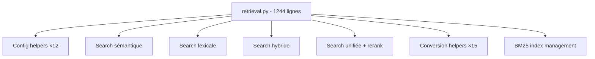

# Revue Globale du Code — RAGKIT Desktop

**Date** : 19 février 2026  
**Version analysée** : v1.2.0 (tag) / `10.0.0` (code interne)  
**Référentiel** : `spécifications/specs-initiales-projet.md` + `specs-etape-0.md` à `specs-etape-11.md`

---

## 1. Synthèse Exécutive

Le projet RAGKIT Desktop est une application desktop ambitieuse couvrant le pipeline RAG complet, de l'ingestion de documents au chat avec génération augmentée. **L'architecture est fonctionnelle et couvre toutes les étapes prévues** (0 à 11) — un accomplissement significatif.

### Points forts
- **Pipeline complet** : Ingestion → Chunking → Embedding → Stockage vectoriel → Recherche (sémantique + lexicale + hybride) → Reranking → Chat RAG avec agents
- **Couverture de tests** : 24 fichiers de tests couvrant agents, config, intégration, LLM, monitoring et retrieval
- **Architecture 3-couches** propre : React ↔ Tauri Rust ↔ Python FastAPI
- **Système de profils** riche avec calibrage dynamique (5 profils × 6 questions)
- **Ingestion incrémentale** avec versioning et historique SQLite
- **Monitoring complet** avec alertes, health checks, query logging

### Problèmes Critiques Identifiés
| # | Sévérité | Problème |
|---|----------|----------|
| P1 | **CRITIQUE** | Version `10.0.0` incohérente dans le code |
| P2 | **HAUTE** | `retrieval.py` API fait 1244 lignes — fichier god-class |
| P3 | **HAUTE** | `EmbeddingEngine.embed_text()` utilise un hash lexical au lieu d'un vrai embedding |
| P4 | **MOYENNE** | Textes français en dur dans 10+ composants (i18n incomplet) |
| P5 | **MOYENNE** | Types `any` dans les hooks frontend |
| P6 | **BASSE** | Tests manquants pour ingestion, documents, chunking, embedding, storage |

---

## 2. Architecture & Structure du Code

### 2.1 Backend Python (`ragkit/`)

```
ragkit/
├── agents/         (5 fichiers, 55 Ko)   ✅ Bien structuré
├── chunking/       (3 fichiers, 12 Ko)   ✅ OK
├── config/         (9 fichiers, 50 Ko)   ✅ Schemas Pydantic solides
├── desktop/        (23 fichiers, 148 Ko) ⚠️ api/retrieval.py trop large
├── embedding/      (5 fichiers, 18 Ko)   ❌ Pas de vrai embedding (P3)
├── ingestion/      (2 fichiers, 1.6 Ko)  ⚠️ Très léger, logique dans desktop/
├── llm/            (5 fichiers, 42 Ko)   ✅ Bonne abstraction providers
├── monitoring/     (4 fichiers, 30 Ko)   ✅ Complet
├── retrieval/      (8 fichiers, 43 Ko)   ✅ Lexical + hybrid bien séparés
├── security/       (2 fichiers, 3.8 Ko)  ✅ OK
└── storage/        (1 fichier, 31 Ko)    ⚠️ Tout dans base.py
```

> [!IMPORTANT]
> Le module `ragkit/ingestion/` ne contient quasi rien (1 `__init__.py` + 1 `file_watcher.py`). La logique d'ingestion est en réalité dans `ragkit/desktop/documents.py` (754 lignes) et `ragkit/desktop/ingestion_runtime.py` (489 lignes). Cette dispersion rend le code difficile à réutiliser hors du contexte desktop.

### 2.2 Frontend React/TS (`desktop/src/`)

```
src/
├── components/
│   ├── wizard/     (10 fichiers, 41 Ko)  ✅ Bien composé
│   ├── settings/   (20 fichiers, 172 Ko) ⚠️ Certains > 17 Ko
│   ├── chat/       (5 fichiers)          ✅ OK
│   ├── dashboard/  (3 fichiers)          ✅ OK
│   └── ui/         (6 fichiers)          ✅ OK
├── hooks/          (31 fichiers, 77 Ko)  ⚠️ Prolifération de hooks
└── pages/          (4 fichiers)          ✅ OK
```

### 2.3 Tauri Rust (`desktop/src-tauri/src/`)

| Fichier | Lignes | Observations |
|---------|--------|--------------|
| [main.rs](file:///c:/Users/henri/Projets/ragkit_desktop/desktop/src-tauri/src/main.rs) | 164 | ✅ Propre, 90+ commandes enregistrées |
| [commands.rs](file:///c:/Users/henri/Projets/ragkit_desktop/desktop/src-tauri/src/commands.rs) | 774 | ⚠️ Proxy HTTP pur — toutes les commandes sont `serde_json::Value` |
| [backend.rs](file:///c:/Users/henri/Projets/ragkit_desktop/desktop/src-tauri/src/backend.rs) | 170 | ✅ Gestion du sidecar Python |

---

## 3. Problèmes Détaillés

### P1 — Version `10.0.0` incohérente ❌ CRITIQUE

La version dans le code source ne correspond pas à la version release :

| Emplacement | Version trouvée | Version attendue |
|-------------|----------------|-----------------|
| [main.py L18](file:///c:/Users/henri/Projets/ragkit_desktop/ragkit/desktop/main.py#L18) | `10.0.0` | `1.2.0` |
| [pyproject.toml L7](file:///c:/Users/henri/Projets/ragkit_desktop/pyproject.toml#L7) | `10.0.0` | `1.2.0` |
| Tag Git | `v1.2.0` | ✅ |

Le numéro `10.0.0` semble être un artefact du plan de releases (étape 10 = `v0.11.0`) mal incrémenté. Le endpoint `/health` retourne cette version incorrecte.

**Action** : Aligner toutes les versions sur le schéma sémantique réel.

---

### P2 — `api/retrieval.py` est un fichier god-class ⚠️ HAUTE

[retrieval.py](file:///c:/Users/henri/Projets/ragkit_desktop/ragkit/desktop/api/retrieval.py) fait **1244 lignes** et contient :
- 64 fonctions/classes
- Logique de recherche sémantique, lexicale, hybride, unifiée
- Helpers de conversion, normalisation, filtrage, reranking
- Gestion de l'index BM25



**Recommandation** : Découper en au minimum 4 fichiers : `config_helpers.py`, `semantic_api.py`, `lexical_api.py`, `unified_api.py`.

---

### P3 — `EmbeddingEngine` n'utilise pas de vrais embeddings ⚠️ HAUTE

[engine.py](file:///c:/Users/henri/Projets/ragkit_desktop/ragkit/embedding/engine.py) implémente `embed_text()` via un **hash lexical SHA-256** (`_hashed_lexical_embed`) au lieu d'appeler les providers configurés (OpenAI, Ollama, etc.) :

```python
def embed_text(self, text: str) -> EmbedOutput:
    start = time.perf_counter()
    vector = self._hashed_lexical_embed(text, self.resolve_dimensions())
    # ↑ Projection déterministe par hash, PAS un vrai embedding sémantique
    ...
```

La méthode `test_connection()` vérifie bien les APIs cloud, mais `embed_text()` ne les appelle jamais. Les vrais appels aux providers (OpenAI, Cohere, etc.) sont implémentés en config/schéma mais le moteur d'embedding en production utilise cette approximation.

**Impact** : La recherche sémantique repose sur des vecteurs non-sémantiques, ce qui dégrade significativement la qualité des résultats RAG.

**Action** : Implémenter les vrais appels provider dans `embed_text()` selon le `config.provider`.

---

### P4 — Internationalisation (i18n) incomplète ⚠️ MOYENNE

De nombreux textes sont en dur en français dans les composants React au lieu d'utiliser les clés i18n :

| Composant | Exemples de textes en dur |
|-----------|---------------------------|
| [IngestionSettings.tsx](file:///c:/Users/henri/Projets/ragkit_desktop/desktop/src/components/settings/IngestionSettings.tsx) | "Chargement de la configuration...", "Configuration sauvegardée", "Analyse en cours..." |
| MetadataDetailPanel.tsx | "Détail du document", "Auteur", "Langue", "Sauvegarder" |
| MetadataTable.tsx | "Rechercher...", "Tous les types" |
| SourceSettings.tsx | "Répertoire source", "Scanner les sous-dossiers" |
| ParsingSettings.tsx | Labels en dur |
| PreprocessingSettings.tsx | Labels en dur |

Ce problème avait déjà été identifié dans la [revue de l'étape 1](file:///c:/Users/henri/Projets/ragkit_desktop/spécifications/revue-globale-etape-1.md) (point 4.6) mais n'a pas été corrigé.

---

### P5 — Types `any` dans les hooks frontend ⚠️ MOYENNE

Plusieurs hooks utilisent `any` au lieu de types précis :

```typescript
// useWizard.ts
folderStats: any | null;  // Devrait être FolderStats | null
folderTree: any | null;   // Devrait être FolderNode | null
```

Les hooks `useIngestionConfig`, `useDocuments`, et `useWizard` passent des données non typées. Cela réduit la sécurité TypeScript et complique la maintenance.

---

### P6 — Tests manquants pour des modules critiques ⚠️ BASSE

| Module | Tests existants | Lacune |
|--------|----------------|--------|
| `agents/` | ✅ 4 tests (memory, orchestrator, analyzer, rewriter) | — |
| `config/` | ✅ 5 tests (schemas) | — |
| `retrieval/` | ✅ 4 tests (hybrid, lexical, rerankers, router) | — |
| `llm/` | ✅ 2 tests (context_assembler, response_generator) | — |
| `monitoring/` | ✅ 3 tests (alerts, health, logger) | — |
| `integration/` | ✅ 6 tests (étapes 6-11) | — |
| **`desktop/documents.py`** | ❌ 0 test | 754 lignes, parsing critique |
| **`desktop/ingestion_runtime.py`** | ❌ 0 test | 489 lignes, pipeline complet |
| **`chunking/`** | ❌ 0 test | Logique de découpage |
| **`embedding/`** | ❌ 0 test | Moteur d'embedding |
| **`storage/`** | ❌ 0 test | Stockage vectoriel |
| **Frontend** | ❌ 0 test | Aucun test React/TS |

> [!WARNING]
> Les modules les plus critiques du pipeline (ingestion, chunking, embedding, storage) n'ont **aucun test unitaire**. Seuls les tests d'intégration étapes 6-11 couvrent partiellement ces fonctionnalités.

---

## 4. Conformité aux Spécifications

### 4.1 Couverture des étapes

| Étape | Spec | Code | Statut |
|-------|------|------|--------|
| 0 — Ossature | `specs-etape-0.md` | App shell, sidebar, 3 onglets | ✅ |
| 1 — Wizard + Ingestion | `specs-etape-1.md` | Wizard 4 écrans, parsing, metadata | ✅ (avec réserves) |
| 2 — Chunking | `specs-etape-2.md` | `chunking/engine.py`, `ChunkingSettings.tsx` | ✅ |
| 3 — Embedding | `specs-etape-3.md` | `embedding/`, `EmbeddingSettings.tsx` | ⚠️ (P3: faux embeddings) |
| 4 — Stockage vectoriel | `specs-etape-4.md` | `storage/base.py`, `VectorStoreSettings.tsx` | ✅ |
| 5 — Recherche sémantique | `specs-etape-5.md` | `SemanticSearchSettings.tsx` | ⚠️ (dépend de P3) |
| 6 — Recherche lexicale | `specs-etape-6.md` | BM25, `LexicalSearchSettings.tsx` | ✅ |
| 7 — Recherche hybride | `specs-etape-7.md` | `hybrid_engine.py`, `HybridSearchSettings.tsx` | ✅ |
| 8 — Reranking | `specs-etape-8.md` | `reranker/`, `RerankSettings.tsx` | ✅ |
| 9 — Chat LLM | `specs-etape-9.md` | `llm/`, `LLMSettings.tsx`, chat UI | ✅ |
| 10 — Agents | `specs-etape-10.md` | `agents/`, `AgentsSettings.tsx` | ✅ |
| 11 — Monitoring | `specs-etape-11.md` | `monitoring/`, `MonitoringSettings.tsx`, dashboard | ✅ |

### 4.2 Écarts architecturaux notables

| Spec | Prévu | Réalisé | Impact |
|------|-------|---------|--------|
| Structure dépôt | `ragkit/ingestion/parsers/`, `ragkit/ingestion/chunkers/` | Logique dans `desktop/documents.py` + `chunking/engine.py` | ⚠️ Couplage desktop |
| `ragkit/ingestion/sources/` | Module sources dédié | `file_watcher.py` uniquement | ⚠️ Minimal |
| `ragkit/config/schema.py` + `schema_v2.py` | Schéma unifié | 9 schémas séparés par domaine | ✅ Meilleur que prévu |
| `ragkit/utils/hardware.py` | Détection GPU | Via `embedding/environment.py` | ✅ OK |
| Tailwind CSS | Prévu dans stack | Utilisé | ✅ |
| stores/ (état global) | `appStore.ts` | Pas de store, hooks uniquement | ✅ OK (pattern React) |

---

## 5. Qualité du Code

### 5.1 Points positifs

- **Conventions Python** respectées : `from __future__ import annotations` systématique, docstrings Google dans les fichiers clés
- **Pydantic v2** utilisé correctement avec `model_validate`, `model_dump(mode="json")` et `Field()` validators
- **Gestion d'erreurs** dans le Rust (`anyhow::Result`) et dans les API (HTTPException)
- **Streaming SSE** correctement implémenté dans le chat
- **Profils de config** exhaustifs avec calibration cross-domain
- **Architecture CORS** correcte pour le localhost (127.0.0.1)

### 5.2 Code smells identifiés

| Catégorie | Détail |
|-----------|--------|
| **État global mutable** | `_CURRENT_CONFIG`, `_DOCUMENTS`, `_LEXICAL_INDEX` comme variables de module dans `api/ingestion.py` et `api/retrieval.py` |
| **Docstring obsolète** | `main.py` dit "Étape 0 : squelette minimal" alors que toutes les étapes sont implémentées |
| **`commands.rs` non typé** | Toutes les commandes Rust prennent `serde_json::Value` au lieu de structs typées — perte de sérialisation à la compilation |
| **Duplication `cosine_similarity`** | Implémentée dans `storage/base.py` ET `embedding/engine.py` |
| **Configuration JSON** | La spec prévoit YAML (`ragkit-v1-config.yaml`) mais le stockage réel est en JSON (`settings.json`) |

---

## 6. Sécurité

| Aspect | Statut | Observation |
|--------|--------|-------------|
| CORS `allow_origins=["*"]` | ⚠️ | Acceptable car localhost uniquement, mais devrait être `["http://localhost:*"]` |
| Clés API | ✅ | Module `security/secrets.py` + Tauri `store_secret`/`secret_exists` |
| Pas d'auth | ✅ | Normal pour app desktop locale |
| Shutdown endpoint | ⚠️ | `POST /shutdown` accessible sans auth — acceptable pour localhost |

---

## 7. Recommandations Priorisées

### Corrections immédiates (Sprint 1)

| # | Action | Effort | Fichiers |
|---|--------|--------|----------|
| **R1** | Corriger la version `10.0.0` → version sémantique cohérente | 0.5h | `main.py`, `pyproject.toml`, `package.json`, `tauri.conf.json`, `Cargo.toml` |
| **R2** | Implémenter les vrais appels embedding provider dans `embed_text()` | 2j | `embedding/engine.py` |
| **R3** | Corrections i18n identifiées en [revue étape 1 § 4.6](file:///c:/Users/henri/Projets/ragkit_desktop/spécifications/revue-globale-etape-1.md) | 1j | 6+ composants settings |

### Refactoring structurel (Sprint 2)

| # | Action | Effort | Fichiers |
|---|--------|--------|----------|
| **R4** | Découper `api/retrieval.py` (1244 lignes) en sous-modules | 1j | `api/retrieval/` |
| **R5** | Déplacer la logique d'ingestion de `desktop/` vers `ragkit/ingestion/` | 2j | `documents.py`, `ingestion_runtime.py` |
| **R6** | Supprimer la duplication `cosine_similarity` | 0.5h | `storage/base.py`, `embedding/engine.py` |
| **R7** | Typer les commandes Rust avec des structs au lieu de `serde_json::Value` | 2j | `commands.rs` |
| **R8** | Remplacer les `any` par des types précis dans les hooks | 0.5j | `useWizard.ts`, etc. |

### Tests (Sprint 3)

| # | Action | Effort | Fichiers |
|---|--------|--------|----------|
| **R9** | Tests unitaires pour `documents.py` (parsing PDF/DOCX/DOC) | 1j | `tests/desktop/` |
| **R10** | Tests unitaires pour `ingestion_runtime.py` | 1j | `tests/desktop/` |
| **R11** | Tests unitaires pour `chunking/engine.py` | 0.5j | `tests/chunking/` |
| **R12** | Tests unitaires pour `embedding/engine.py` | 0.5j | `tests/embedding/` |
| **R13** | Tests unitaires pour `storage/base.py` | 0.5j | `tests/storage/` |
| **R14** | Tests paramétrés profil × calibrage (T3 spec étape 1) | 1j | `tests/config/` |

---

## 8. Métriques de Taille du Code

| Couche | Fichiers | Lignes (approx.) | Commentaire |
|--------|----------|-------------------|-------------|
| Backend Python | ~50 fichiers | ~6 500 lignes | Raisonnable |
| Frontend React/TS | ~50 fichiers | ~4 500 lignes | Raisonnable |
| Rust Tauri | 3 fichiers | ~1 100 lignes | Principalement proxy |
| Tests | 24 fichiers | ~2 000 lignes | Couverture partielle |
| Specs | 21 fichiers | ~15 000 lignes | Documentation riche |
| **Total** | **~150 fichiers** | **~29 000 lignes** | Projet de taille moyenne |

---

## 9. Verdict

**Le projet est fonctionnellement complet pour la v1** : les 12 étapes du plan de développement sont implémentées, le pipeline RAG fonctionne de bout en bout, et l'interface utilisateur couvre tous les paramètres.

Les principaux risques portent sur :
1. **La qualité des résultats RAG** (P3 : embeddings factices) — c'est le problème le plus impactant pour l'utilisateur final
2. **La maintenabilité** (P2 : fichiers trop volumineux, logique mal placée)
3. **La fiabilité** (P6 : modules critiques sans tests)

**Recommandation** : Prioriser R2 (vrais embeddings) en urgence, puis R4-R5 (refactoring structurel) avant d'ajouter de nouvelles fonctionnalités.
