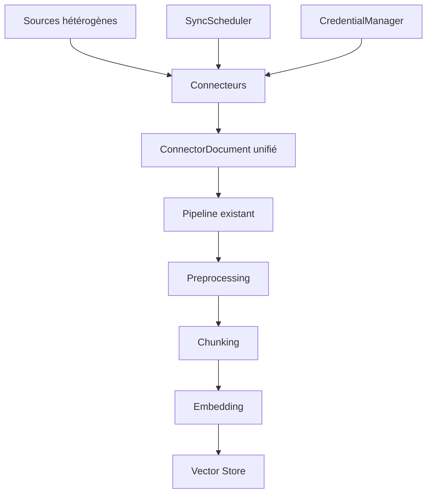

# Spécification : Sources multi-types pour la base de connaissances

> **Version** : 1.0  
> **Date** : 2026-03-27  
> **Statut** : Proposition

---

## 1. Contexte et objectif

Actuellement, LOKO ne supporte qu'un seul type de source : un **répertoire local** sur le poste de l'utilisateur. Cette limitation restreint considérablement les cas d'usage d'un RAG moderne.

L'objectif est d'étendre le système pour supporter **plusieurs sources hétérogènes**, chacune avec son propre connecteur, ses règles de synchronisation et sa fréquence de mise à jour.

---

## 2. État actuel (architecture impactée)

| Composant | Fichier | Rôle actuel |
|---|---|---|
| Modèle source | `ragkit/desktop/models.py` → `SourceConfig` | Un seul `path` local, types de fichiers, exclusions |
| UI source | `desktop/src/components/settings/SourceSettings.tsx` | Sélecteur de répertoire Tauri, checkboxes types |
| Scanner de fichiers | `ragkit/desktop/documents.py` | `_iter_files()` parcourt un répertoire local |
| Runtime d'ingestion | `ragkit/desktop/ingestion_runtime.py` | `detect_changes()` et `_run()` lisent des fichiers locaux |
| File watcher | `ragkit/ingestion/file_watcher.py` | Debounce sur signature de changement |
| API ingestion | `ragkit/desktop/api/ingestion.py` | Endpoints REST pour config et contrôle |

---

## 3. Types de sources proposés

### 3.1 Répertoire local (existant)
- **Type** : `local_directory`
- **Paramètres** : chemin absolu, récursif, exclusions, types de fichiers, taille max
- **Sync** : manuelle ou auto via file watcher (existant)

### 3.2 URLs / Pages web
- **Type** : `web_url`
- **Description** : L'utilisateur fournit une liste d'URLs à scraper
- **Paramètres** :
  - `urls: list[str]` — URLs des pages à indexer
  - `crawl_depth: int` (0 = page seule, 1 = liens directs, 2+ = profondeur)
  - `crawl_same_domain_only: bool` — Limiter le crawl au même domaine
  - `include_patterns: list[str]` — Patterns glob/regex d'URLs à inclure
  - `exclude_patterns: list[str]` — Patterns à exclure (login, CGU, etc.)
  - `max_pages: int` — Limite de pages à crawler
  - `extract_mode: "text" | "markdown" | "html_clean"` — Mode d'extraction du contenu
  - `respect_robots_txt: bool` — Respecter robots.txt
  - `user_agent: str` — User-agent personnalisé
- **Sync** : planifiée (fréquence configurable)
- **Détection de changement** : comparaison hash du contenu HTML / ETag / Last-Modified

### 3.3 Flux RSS / Atom
- **Type** : `rss_feed`
- **Description** : Surveille un ou plusieurs flux RSS et indexe les articles
- **Paramètres** :
  - `feed_urls: list[str]` — URLs des flux RSS/Atom
  - `max_articles: int` — Nombre max d'articles à conserver
  - `fetch_full_content: bool` — Récupérer le contenu complet de l'article (vs résumé RSS)
  - `content_selectors: list[str]` — Sélecteurs CSS pour extraction du contenu (si fetch_full_content)
- **Sync** : planifiée (fréquence configurable, min 15 min)
- **Détection de changement** : `guid` / `pubDate` des items RSS

### 3.4 Google Drive
- **Type** : `google_drive`
- **Description** : Connexion OAuth2 à Google Drive, sélection de dossiers à indexer
- **Paramètres** :
  - `folder_ids: list[str]` — IDs des dossiers Google Drive à surveiller
  - `include_shared: bool` — Inclure les fichiers partagés avec l'utilisateur
  - `file_types: list[str]` — Types MIME à inclure (Google Docs, Sheets, PDF, etc.)
  - `recursive: bool` — Scanner les sous-dossiers
  - `max_file_size_mb: int`
- **Authentification** : OAuth2 (token stocké dans keyring sécurisé)
- **Sync** : planifiée + webhook Google Drive (si disponible)
- **Détection de changement** : `modifiedTime` de l'API Drive
- **Export** : Google Docs → texte, Google Sheets → CSV/markdown, Google Slides → texte

### 3.5 OneDrive / SharePoint
- **Type** : `onedrive`
- **Description** : Connexion via Microsoft Graph API
- **Paramètres** :
  - `drive_id: str | None` — ID du drive (défaut = OneDrive personnel)
  - `folder_paths: list[str]` — Chemins relatifs des dossiers à surveiller
  - `site_id: str | None` — ID site SharePoint (optionnel)
  - `file_types: list[str]`
  - `recursive: bool`
  - `max_file_size_mb: int`
- **Authentification** : OAuth2 Microsoft (MSAL)
- **Sync** : planifiée + delta queries Microsoft Graph
- **Détection de changement** : delta API Microsoft Graph (efficace)

### 3.6 Dropbox
- **Type** : `dropbox`
- **Description** : Connexion API Dropbox
- **Paramètres** :
  - `folder_paths: list[str]` — Dossiers Dropbox à indexer
  - `file_types: list[str]`
  - `recursive: bool`
  - `max_file_size_mb: int`
- **Authentification** : OAuth2 Dropbox
- **Sync** : planifiée + longpoll (Dropbox list_folder/longpoll)
- **Détection de changement** : cursor Dropbox (natif et efficace)

### 3.7 Confluence / Wiki
- **Type** : `confluence`
- **Description** : Indexation d'espaces Confluence (Cloud ou Server)
- **Paramètres** :
  - `base_url: str` — URL de l'instance Confluence
  - `space_keys: list[str]` — Espaces à indexer
  - `include_attachments: bool` — Indexer les pièces jointes
  - `include_comments: bool` — Inclure les commentaires
  - `page_limit: int` — Nombre max de pages
  - `label_filter: list[str]` — Filtrer par labels (optionnel)
  - `exclude_archived: bool` — Exclure les pages archivées
- **Authentification** : API token Atlassian ou Basic Auth
- **Sync** : planifiée (CQL `lastModified`)
- **Détection de changement** : CQL query avec date de dernière modification

### 3.8 Notion
- **Type** : `notion`
- **Description** : Indexation de bases de données et pages Notion
- **Paramètres** :
  - `database_ids: list[str]` — IDs des bases de données Notion
  - `page_ids: list[str]` — IDs de pages Notion individuelles
  - `include_subpages: bool` — Inclure les sous-pages
  - `property_filters: dict` — Filtres sur les propriétés des bases
- **Authentification** : Token d'intégration Notion (internal integration)
- **Sync** : planifiée
- **Détection de changement** : `last_edited_time` de l'API Notion

### 3.9 Base de données SQL
- **Type** : `sql_database`
- **Description** : Extraction de contenu textuel depuis une base SQL
- **Paramètres** :
  - `connection_string: str` — Chaîne de connexion (PostgreSQL, MySQL, SQLite)
  - `query: str` — Requête SQL d'extraction (doit retourner `id`, `content`, `metadata`)
  - `id_column: str` — Colonne identifiant unique
  - `content_column: str` — Colonne contenant le texte
  - `metadata_columns: list[str]` — Colonnes de métadonnées à conserver
  - `incremental_column: str | None` — Colonne date/timestamp pour détection incrémentale
- **Authentification** : credentials dans la chaîne de connexion (stockés dans keyring)
- **Sync** : planifiée
- **Détection de changement** : `WHERE incremental_column > last_sync_date`

### 3.10 API REST générique
- **Type** : `rest_api`
- **Description** : Connecteur générique pour APIs REST paginées
- **Paramètres** :
  - `base_url: str`
  - `endpoint: str` — Chemin de l'endpoint
  - `method: "GET" | "POST"`
  - `headers: dict[str, str]` — Headers personnalisés (Bearer token, etc.)
  - `pagination_type: "offset" | "cursor" | "page" | "none"`
  - `response_content_path: str` — JSONPath vers le contenu textuel
  - `response_id_path: str` — JSONPath vers l'identifiant
  - `response_items_path: str` — JSONPath vers la liste d'items
  - `max_items: int`
- **Authentification** : Header personnalisé (API key, Bearer token)
- **Sync** : planifiée
- **Détection de changement** : selon l'API (ETag, timestamp, hash)

### 3.11 Fichiers S3 / MinIO
- **Type** : `s3_bucket`
- **Description** : Indexation de fichiers dans un bucket S3 ou compatible
- **Paramètres** :
  - `bucket: str`
  - `prefix: str` — Préfixe de clé (dossier virtuel)
  - `region: str`
  - `endpoint_url: str | None` — Pour MinIO ou S3-compatible
  - `file_types: list[str]`
  - `max_file_size_mb: int`
  - `recursive: bool`
- **Authentification** : AWS credentials (access key + secret, profil AWS, ou IAM role)
- **Sync** : planifiée
- **Détection de changement** : `LastModified` des objets S3, ou S3 Event Notifications

### 3.12 Email (IMAP)
- **Type** : `email_imap`
- **Description** : Indexation d'emails depuis un serveur IMAP (Gmail, Outlook, etc.)
- **Paramètres** :
  - `server: str` — Serveur IMAP (ex: `imap.gmail.com`)
  - `port: int` — Port (993 pour SSL)
  - `use_ssl: bool`
  - `folders: list[str]` — Dossiers mail à indexer (INBOX, Sent, etc.)
  - `include_attachments: bool` — Indexer les pièces jointes
  - `max_emails: int` — Nombre max d'emails
  - `date_from: str | None` — Date de début (ISO 8601)
  - `subject_filter: str | None` — Filtrer par sujet
  - `sender_filter: list[str]` — Filtrer par expéditeur
- **Authentification** : identifiant + mot de passe applicatif (ou OAuth2 pour Gmail)
- **Sync** : planifiée
- **Détection de changement** : UIDVALIDITY + UID IMAP

### 3.13 Git Repository
- **Type** : `git_repo`
- **Description** : Clone et indexation de fichiers d'un dépôt Git
- **Paramètres** :
  - `repo_url: str` — URL du dépôt (HTTPS ou SSH)
  - `branch: str` — Branche à indexer (défaut: `main`)
  - `file_types: list[str]` — Extensions à inclure
  - `excluded_dirs: list[str]` — Dossiers à exclure (node_modules, .git, etc.)
  - `include_readme_only: bool` — N'indexer que les README et la doc
  - `max_file_size_mb: int`
- **Authentification** : token Git (PAT) ou clé SSH
- **Sync** : planifiée (git pull)
- **Détection de changement** : `git diff` entre les commits

---

## 4. Architecture proposée

### 4.1 Modèle de données : Multi-sources

La notion de source unique (`SourceConfig.path`) est remplacée par une **liste de sources hétérogènes**.

```python
class SourceType(str, Enum):
    LOCAL_DIRECTORY = "local_directory"
    WEB_URL = "web_url"
    RSS_FEED = "rss_feed"
    GOOGLE_DRIVE = "google_drive"
    ONEDRIVE = "onedrive"
    DROPBOX = "dropbox"
    CONFLUENCE = "confluence"
    NOTION = "notion"
    SQL_DATABASE = "sql_database"
    REST_API = "rest_api"
    S3_BUCKET = "s3_bucket"
    EMAIL_IMAP = "email_imap"
    GIT_REPO = "git_repo"

class SyncFrequency(str, Enum):
    MANUAL = "manual"          # Uniquement à la demande
    EVERY_15_MIN = "15min"
    HOURLY = "1h"
    EVERY_6H = "6h"
    DAILY = "24h"
    WEEKLY = "7d"

class SourceStatus(str, Enum):
    ACTIVE = "active"
    PAUSED = "paused"
    ERROR = "error"
    SYNCING = "syncing"

class BaseSourceConfig(BaseModel):
    """Configuration commune à toutes les sources."""
    id: str                              # UUID unique de la source
    name: str                            # Nom affiché (ex: "Docs internes")
    type: SourceType
    enabled: bool = True
    sync_frequency: SyncFrequency = SyncFrequency.MANUAL
    status: SourceStatus = SourceStatus.ACTIVE
    last_sync_at: str | None = None
    last_sync_status: str | None = None
    last_sync_error: str | None = None
    document_count: int = 0
    created_at: str
    # Paramètres spécifiques selon le type (dict libre, validé par le connecteur)
    config: dict[str, Any] = Field(default_factory=dict)
    # Credentials reference (clé dans le keyring, jamais en clair)
    credential_key: str | None = None

class IngestionConfig(BaseModel):
    sources: list[BaseSourceConfig] = Field(default_factory=list)
    parsing: ParsingConfig = Field(default_factory=ParsingConfig)
    preprocessing: PreprocessingConfig = Field(default_factory=PreprocessingConfig)
```

### 4.2 Abstraction des connecteurs (Backend)

```
ragkit/
  connectors/
    __init__.py
    base.py              # BaseConnector (ABC)
    local_directory.py   # Connecteur existant refactorisé
    web_url.py
    rss_feed.py
    google_drive.py
    onedrive.py
    dropbox.py
    confluence.py
    notion.py
    sql_database.py
    rest_api.py
    s3_bucket.py
    email_imap.py
    git_repo.py
    registry.py          # Registre de connecteurs (factory pattern)
```

#### Interface du connecteur de base

```python
class ConnectorDocument:
    """Document unifié retourné par tous les connecteurs."""
    id: str                    # Identifiant unique (hash de source_id + chemin/url)
    source_id: str             # ID de la source parente
    title: str
    content: str               # Texte extrait
    content_type: str          # "text", "html", "markdown"
    url: str | None            # URL d'origine si applicable
    file_path: str | None      # Chemin relatif si applicable
    file_type: str | None      # Extension ou type MIME
    file_size_bytes: int
    last_modified: str         # ISO 8601
    metadata: dict[str, Any]   # Métadonnées spécifiques au connecteur
    content_hash: str          # Hash SHA-256 du contenu pour détection de changement

class BaseConnector(ABC):
    """Interface commune pour tous les connecteurs de source."""
    
    @abstractmethod
    async def validate_config(self) -> ConnectorValidationResult:
        """Vérifie que la configuration est valide et la source accessible."""
        ...

    @abstractmethod
    async def test_connection(self) -> ConnectionTestResult:
        """Teste la connexion à la source (credentials, réseau, permissions)."""
        ...

    @abstractmethod
    async def list_documents(self) -> list[ConnectorDocument]:
        """Liste tous les documents disponibles dans la source."""
        ...

    @abstractmethod
    async def fetch_document(self, doc_id: str) -> ConnectorDocument:
        """Récupère le contenu complet d'un document."""
        ...

    @abstractmethod
    async def detect_changes(self, last_sync: str | None) -> ChangeDetectionResult:
        """Détecte les changements depuis la dernière synchronisation."""
        ...

    @abstractmethod
    def supported_file_types(self) -> list[str]:
        """Retourne la liste des types de fichiers supportés par ce connecteur."""
        ...
```

### 4.3 Scheduler de synchronisation

Un nouveau composant `SyncScheduler` gère la planification des synchronisations.

```python
class SyncScheduler:
    """Planificateur de synchronisation pour les sources avec fréquence définie."""
    
    async def start(self) -> None:
        """Démarre le scheduler en arrière-plan."""

    async def stop(self) -> None:
        """Arrête le scheduler."""

    async def schedule_source(self, source: BaseSourceConfig) -> None:
        """Planifie ou replanifie la synchronisation d'une source."""

    async def unschedule_source(self, source_id: str) -> None:
        """Retire une source du planning."""

    async def trigger_now(self, source_id: str) -> None:
        """Déclenche une synchronisation immédiate d'une source."""

    async def get_next_sync(self, source_id: str) -> str | None:
        """Retourne la date de prochaine sync planifiée."""
```

### 4.4 Gestion des credentials

Les credentials ne sont **jamais** stockés dans le fichier de configuration.

```python
class CredentialManager:
    """Gestionnaire de credentials sécurisé."""

    async def store(self, key: str, credential: dict) -> None:
        """Stocke un credential dans le keyring système."""

    async def retrieve(self, key: str) -> dict | None:
        """Récupère un credential depuis le keyring."""

    async def delete(self, key: str) -> None:
        """Supprime un credential du keyring."""

    async def oauth2_flow(self, provider: str) -> dict:
        """Lance un flux OAuth2 et retourne les tokens."""
```

---

## 5. Interface utilisateur

### 5.1 Page de gestion des sources (nouveau)

Remplacement du composant `SourceSettings.tsx` actuel par une interface riche :

#### Vue liste des sources
- **Tableau/cartes** affichant toutes les sources configurées
- Pour chaque source :
  - Icône du type (📁 Local, 🌐 Web, 📰 RSS, ☁️ Drive, etc.)
  - Nom personnalisé
  - Statut (actif / en pause / erreur / en synchro)
  - Nombre de documents indexés
  - Dernière synchronisation (date relative)
  - Prochaine synchronisation planifiée
  - Boutons : Sync maintenant / Pause / Éditer / Supprimer

#### Ajout d'une source (dialog/wizard)
1. **Choix du type** — Grille de cartes avec icônes et descriptions
2. **Configuration spécifique** — Formulaire adapté au type choisi :
   - Local : sélecteur de dossier (existant)
   - Web : champs URLs + profondeur + patterns
   - Google Drive : bouton "Se connecter" (OAuth) + sélecteur de dossiers
   - etc.
3. **Fréquence de synchronisation** — Sélecteur (manuel, 15min, 1h, 6h, 24h, 7j)
4. **Test de connexion** — Bouton de test avant validation
5. **Nom de la source** — Champ texte pour nommer la source

### 5.2 Indicateurs par source dans le dashboard
- Graphique de couverture par source
- Historique de synchronisation par source
- Alertes en cas d'erreur de sync

---

## 6. API REST (évolutions)

### Nouvelles routes

| Méthode | Route | Description |
|---|---|---|
| `GET` | `/api/sources` | Liste toutes les sources configurées |
| `POST` | `/api/sources` | Ajoute une nouvelle source |
| `GET` | `/api/sources/{id}` | Détails d'une source |
| `PUT` | `/api/sources/{id}` | Met à jour une source |
| `DELETE` | `/api/sources/{id}` | Supprime une source et ses documents indexés |
| `POST` | `/api/sources/{id}/test` | Teste la connexion à la source |
| `POST` | `/api/sources/{id}/sync` | Déclenche une synchronisation immédiate |
| `GET` | `/api/sources/{id}/sync/history` | Historique de sync de la source |
| `POST` | `/api/sources/{id}/pause` | Met en pause la synchronisation |
| `POST` | `/api/sources/{id}/resume` | Reprend la synchronisation |
| `GET` | `/api/sources/types` | Liste les types de sources disponibles |
| `POST` | `/api/sources/{id}/oauth/start` | Démarre un flux OAuth2 |
| `POST` | `/api/sources/{id}/oauth/callback` | Callback OAuth2 |

### Rétrocompatibilité

Les routes existantes (`/api/ingestion/config`, etc.) continuent de fonctionner. Si la configuration contient l'ancien format `source.path`, elle est automatiquement migrée vers une source de type `local_directory`.

---

## 7. Plan d'implémentation par phases

### Phase 1 — Fondations (priorité haute)
- [ ] Refactoring du modèle `SourceConfig` → `BaseSourceConfig` + liste de sources
- [ ] Création de l'interface `BaseConnector` et du registre
- [ ] Migration du code existant vers `LocalDirectoryConnector`
- [ ] Migration du schéma de configuration (rétrocompatibilité)
- [ ] Nouvelle UI de gestion des sources (liste + ajout)
- [ ] Nouvelles routes API REST
- [ ] `SyncScheduler` basique (timer simple)

### Phase 2 — Sources web (priorité haute)
- [ ] `WebUrlConnector` — scraping avec `httpx` + `beautifulsoup4`
- [ ] `RssFeedConnector` — parsing avec `feedparser`
- [ ] UI spécifique pour configuration URLs et RSS
- [ ] Détection de changement par hash et dates HTTP

### Phase 3 — Cloud storage (priorité moyenne)
- [ ] `GoogleDriveConnector` — API Drive v3 + OAuth2
- [ ] `OneDriveConnector` — Microsoft Graph API + MSAL
- [ ] `DropboxConnector` — Dropbox API
- [ ] `CredentialManager` avec keyring + flux OAuth2 via fenêtre Tauri
- [ ] UI avec boutons "Se connecter" et sélecteurs de dossiers cloud

### Phase 4 — Sources collaboratives (priorité moyenne)
- [ ] `ConfluenceConnector` — API REST Confluence
- [ ] `NotionConnector` — API Notion
- [ ] UI dédiée avec sélecteurs d'espaces/pages

### Phase 5 — Sources techniques (priorité basse)
- [ ] `SqlDatabaseConnector` — via `asyncpg` / `aiomysql` / `aiosqlite`
- [ ] `RestApiConnector` — connecteur générique JSON
- [ ] `S3BucketConnector` — via `aiobotocore`
- [ ] `EmailImapConnector` — via `aioimaplib`
- [ ] `GitRepoConnector` — via `gitpython`

---

## 8. Dépendances Python additionnelles

| Source | Packages | Taille estimée |
|---|---|---|
| Web URL | `httpx`, `beautifulsoup4`, `lxml` | ~5 Mo |
| RSS | `feedparser` | ~1 Mo |
| Google Drive | `google-api-python-client`, `google-auth-oauthlib` | ~15 Mo |
| OneDrive | `msal`, `httpx` | ~5 Mo |
| Dropbox | `dropbox` | ~5 Mo |
| Confluence | `httpx` (déjà inclus) | 0 |
| Notion | `httpx` (déjà inclus) | 0 |
| SQL | `asyncpg`, `aiomysql`, `aiosqlite` | ~3 Mo |
| S3 | `aiobotocore` | ~10 Mo |
| Email | `aioimaplib` | ~1 Mo |
| Git | `gitpython` | ~5 Mo |

> [!IMPORTANT]
> Les dépendances doivent être **optionnelles** (extras pip). Seuls les packages nécessaires aux connecteurs activés sont installés. L'app de base ne doit pas grossir.

---

## 9. Sécurité

- Les credentials (tokens OAuth, API keys, mots de passe) sont stockés dans le **keyring système** (Windows Credential Manager, macOS Keychain, libsecret)
- Les tokens OAuth2 sont renouvelés automatiquement (refresh token)
- Les chaînes de connexion SQL ne sont **jamais** incluses dans les exports de configuration
- Le chiffrement au repos des données locales suit la politique existante de `SecuritySettings`
- Rate limiting côté client pour les APIs externes (respecter les quotas)

---

## 10. Métadonnées enrichies

Chaque `DocumentInfo` existant est enrichi avec des champs de traçabilité :

```python
class DocumentInfo(BaseModel):
    # ... champs existants ...
    source_id: str            # ID de la source d'origine
    source_type: SourceType   # Type de la source
    source_name: str          # Nom affiché de la source
    original_url: str | None  # URL d'origine (web, drive, etc.)
    sync_version: str | None  # Version de sync qui a indexé ce document
```

Cela permet dans le chat de **citer la source précise** (lien Drive, URL web, page Confluence) plutôt qu'un simple chemin de fichier.

---

## 11. Impact sur le pipeline existant



Le pipeline actuel (preprocessing → chunking → embedding → vector store) **reste inchangé**. Seule la couche d'acquisition de documents en amont est abstraite. Les connecteurs produisent un format `ConnectorDocument` unifié qui alimente le pipeline existant.

---

## 12. Considérations techniques

### Performance
- Les connecteurs cloud font des appels réseau : utiliser `asyncio` systématiquement
- Cache local des fichiers téléchargés (avec TTL configurable)
- Téléchargement parallèle avec sémaphore (configurable, défaut = 5 concurrent)

### Résilience
- Retry avec backoff exponentiel pour les appels réseau
- Timeout configurable par connecteur
- En cas d'erreur sur un document, continuer avec les suivants (fail-open)
- Journalisation détaillée par source dans l'historique de sync

### Taille du binaire
- Les dépendances cloud sont en extras pip, non incluses dans le build de base
- Le build PyInstaller inclut uniquement les connecteurs activés dans la configuration

### Migration
- L'ancien format `SourceConfig.path` est automatiquement converti en source `local_directory`
- Aucune perte de données ni ré-ingestion nécessaire lors de la migration
